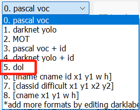

# DarkLabel-
1、打开exe文件

2、第1处选择图片位置

3、第2处选择数据集类型，选择

4、第3处选择标签名称，目前只选择0即可

对于标注跟踪数据来说，可以选择这部分的跟踪方法粗标注后微调，点击会按照选择的跟踪方法标注下一帧。

Tracker1(robust)
插值法，每次一个目标。
首先在第一帧点击Begin Interpolation，然后画目标bbox，按↓键往后几十帧，在找到该目标画出bbox，点击End Interpolation，然后就可以看到中间帧该目标都被圈住了，效果挺好的。

Tracker2(accurate)
在当前帧画出多个目标bbox，然后点击next,这些算法，越往后bbox就越不准了，但是可以多个目标同时跟踪，插值效果比较好，但是只能一个一个目标跟踪，自己选择。

标注完成后定时点击保存标签

# 功能快捷键

Arow / PgUp / PgDn / Home / End：浏览图像帧

鼠标：左（创建框），右（取消最近创建的框）

Shift +鼠标：向左（修改框），向右（删除所选框/轨迹或所有框）

Shift + DoubleClick：修改框属性（标签，ID，难度）

Ctrl +’+’/’-’：放大/缩小

Ctrl +箭头：滚动缩放窗口

Ctrl + 滚珠：放大/缩小

Ctrl +s：保存gt

F1：显示此帮助

撤回画的bbox：在任意区域按压鼠标右键，以出栈的顺序依次删除bbox

删除指定bbox：鼠标放在bbox上，按压shift键，点击鼠标右键删除bbox

调整bbox：鼠标放在bbox上，按压shift键，点击鼠标左键可以修改bbox类别和id
